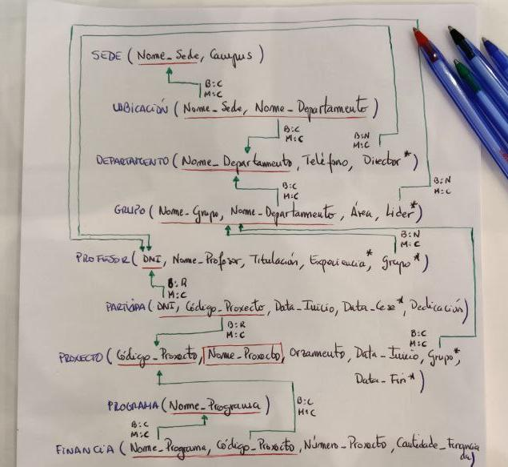
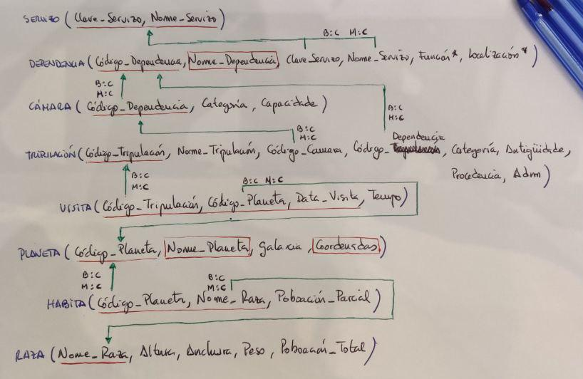

# Apuntes Sublenguajes SQL

 - [Tipos de Sublenguajes](#Tipos-de-Sublenguajes)
 
   - [DDL - Data Definition Language](#DDL---Data-Definition-Language)

      - [Crear Bases de Datos](#algo)

      - [Crear Tablas](#algo)

        - [Declaración de Atributos](#algo)

        - [Restricciones:](#algo)
  
          - [Clave Primaria](#algo)
          - [Clave Foránea](#algo)
          - [UNIQUE](#algo)
          - [DEFAULT](#algo)
          - [CHECK](#algo)
          - [ASSERTION](#algo)

      - [Modificar Tablas](#algo)

      - [Eliminar Tablas / Bases de Datos](#algo)  

   - [DML - Data Manipulation Language](#utilidades-varias)

      - [Insertar Datos](#algo)

      - [Actualizar Datos](#algo)

      - [Eliminar Datos](#algo)

 - [Ejemplos de Ejercicios Modelo](#ejemplos-consultas-complejas)

 - [Referencias Externas:](#introducción-a-sql)

   - [Documentación PostgreSQL](#introducción-a-sql)

   - [Explicación y Ejemplos - W3Schools](#introducción-a-sql)

***
***


## Tipos de Sublenguajes

Solo existe **1 lenguaje SQL**, sin embargo, este lenguajes cuenta con **6 sublenguajes**.


### **DQL (Data Query Language)**:  
      
Opera sobre los datos de la Base de Datos y sirve para obtener los datos deseados.

- **Comandos**:
		
  - ***SELECT*** (Antes estaba en el DML)

### **DDL (Data Definition Language)**:

Opera sobre los objetos de la Base de Datos, como tablas, filas, columnas, etc.

- **Comandos**:
		
  - ***CREATE***
  - ***ALTER***
  - ***DROP***

### **DML (Data Manipulation Language)**:

Opera sobre los datos de la Base de Datos, **no** sobre los objetos.

- **Comandos**:

  - ***INSERT***
  - **UPDATE**
  - **DELETE**

### **TCL (Transaction Control Language)**:

Permite administrar diferentes transacciones que ocurren dentro de una Base de Datos.

- **Comandos**:

  - ***COMMIT***
  - ***ROLLBACK***

### **DCL (Data Control Language)**:

Se encarga de controlar el acceso a los datos contenidos en la Base de Datos.

- **Comandos**:
		
  - ***GRANT***
  - ***REVOKE***

### **SCL (Session Control Language)**:

Se encarga de controlar dinamicamente las propiedades de una sesión de usuario.

- **Comandos**:
		
  - ***ALTER SESSION*** 


***
***


## DDL - Data Definition Language

Opera sobre los objetos de la Base de Datos, permitiéndonos crear tablas, establecer claves, etc.


### **Crear Bases de Datos**

Para crear Bases de Datos utilizaremos la siguiente sintaxis:  

```SQL
CREATE (DATABASE | SCHEMA) [IF NOT EXISTS] <nombreBD> [CHARACTER SET <nombreDelCharset>];
```

La utilización de ***DATABASE*** o ***SCHEMA*** se diferencia principalmente por los permisos en el momento de crear la Base de Datos.

- **Opciones**:

  - ***IF NOT EXISTS***: comprueba si la Base de Datos a crear existe o no.
  - ***CHARACTER SET***: determina el conjunto de caracteres que se va a utilizar.


> **Ejemplos**:

```SQL
CREATE DATABASE pruebaBD;
```

```SQL
CREATE DATABASE IF NOT EXISTS pruebaBD2;
```

***


### **Crear Tablas**

Para crear Tablas utilizaremos la siguiente sintaxis:  

```SQL
CREATE TABLE <nombreTabla> (

	<atributo1> tipoDato,
	<atributo2> tipoDato

);
```

En el momento de la creación de la Tabla, se pueden definir **RESTRICCIONES** en los atributos.  

Dichas restricciones, se explicarán más adelante y veremos como definirlas a la hora de crear la Tabla.


> **Ejemplo**:

```SQL
CREATE TABLE Alumnos (

	nombre VARCHAR(255),
	telefono CHAR(9)

);
```

***


### **Declaración de Atributos**

Para declarar Atributos utilizaremos la siguiente sintaxis:  

```SQL
<atributo1> tipoDato [PRIMARY KEY] [UNIQUE] [NOT NULL]
```

En el momento de declarar el Atributo, se le pueden aplicar ciertas **RESTRICCIONES**, sin embargo, en mi opinión, es preferible definirlas a parte y asi mantener cierta organización.

Es decir, en lugar de definirlos de esta forma:

```SQL
CREATE TABLE Alumnos (

	nombre VARCHAR(255),
	DNI CHAR(9) PRIMARY KEY

);
```

Mejor definirlos de esta otra forma:

```SQL
CREATE TABLE Alumnos (

	nombre VARCHAR(255),
	DNI CHAR(9),
	CONSTRAINT PK_Alumnos
		PRIMARY KEY (DNI)

);
```

Esta última estructura se explicará más adelante, cuando se vean las **RESTRICCIONES**.  


### **Tipos de Datos**

A la hora de declarar un Atributo, tenemos que indicar el tipo de dato que va a almacenar.  

Existen gran cantidad de tipos de datos, pero los **más usados** son los siguientes:

- **Numéricos**:
  
  - ***INTEGER***
  - ***DECIMAL*** (preciso)
  - ***REAL*** (no preciso)

- **Texto**:
  
  - ***CHAR*** (longitud fija limitada)
  - ***VARCHAR*** (longitud variable limitada)
  - ***TEXT*** (longitud variable ilimitada)

- **Tiempo**:
  
  - ***DATE***
  - ***TIME***
  - ***TIMESTAMP*** (DATE + TIME)

- **Otros**:
  
  - ***BOOLEAN*** ( true = 1 / false = 0 )
  - ***MONEY***
  - ***UUID*** (identificador único)
  - ***JSON***

Por otra parte, podemos crear nuestros propios **Dominios de dato** haciendo uso de los tipos de datos anteriores.

De esta manera, indicamos el Dominio de dato creado en lugar de especificar el mismo tipo de dato en diferentes atributos.

> **Ejemplo**:

```SQL
CREATE DOMAIN Tipo_DNI CHAR(9);
```

```SQL
CREATE TABLE Alumnos (

	nombre VARCHAR(255),
	DNI Tipo_DNI

);
```

***


### **Restricciones**

Para declarar Atributos utilizaremos la siguiente sintaxis:  

```SQL
<atributo1> tipoDato [PRIMARY KEY] [UNIQUE] [NOT NULL]
```

En el momento de declarar el Atributo, se le pueden aplicar ciertas **RESTRICCIONES**, sin embargo, en mi opinión, es preferible definirlas a parte y asi mantener cierta organización.

Es decir, en lugar de definirlos de esta forma:

```SQL
CREATE TABLE Alumnos (

	nombre VARCHAR(255),
	DNI CHAR(9) PRIMARY KEY

);
```


***
***
***

# ---> PARTE SUCIA - APUNTES <---

DDL:

- CREATE: 

	Bases de Datos (CREATE DATABASE myDB | CREATE SCHEMA myOtherDB)
       		     Se diferencian por los permisos al momento de crearla

		Ej: CREATE (DATABASE | SCHEMA) [IF NOT EXISTS] <nomBD> [CHARACTER SET <nomeDoCharset>]

	Tablas (CREATE TABLE tabName)

		https://www.postgresql.org/docs/8.4/ddl-constraints.html#DDL-CONSTRAINTS-FK --> DOCUMENTAR PK Y FK
		
		Opciones para ON DELETE:

		NO ACTION: no realiza ninguna accion sobre los datos. Se mantienen

		CASCADE: los datos se borran

		SET NULL: se pone a nulo ¿?

		SET DEFAULT: cuando desaparece se asignan los datos a un sitio ficticio pero que existe

	    - MATCH FULL: todos los campos, tanto de la tabla  con la clave principal como de la tabla con la clave foranea no pueden estar a null

	     - MATCH PARCIAL: permite tener uno de los campos de la tabla a null

	Usuarios


- Restricciones:

	CONSTRAINT ---> Tipos de restricciones

		- PRIMARY KEY:

		- FOREIGN KEY:
	
		- UNIQUE (atributo): permite que todos los valores sean diferentes

		- CHECK predicado (atributo): realizar comprobaciones

			opciones posibles a mayores (not deferrable es el valor predeterminado):

				- NOT DEFERRABLE: comprueba en el momento en el que se intenta hacer la accion

				- DEFERRABLE INITIALLY DEFFERRABLE: comprueba al final


- DROP:

	Bases de Datos: DROP SCHEMA [IF EXISTS] myBD

	Tabla: DROP TABLE [IF EXISTS] nomTabla [CASCADE (borra las tablas hijas) | RESTRICT (no puedes borrar la tabla porque tiene tablas hijas relacionadas con la tabla que se intenta borrar)]


- ALTER:

	ALTER TABLE nomTabla

		ADD [COLUMN] <atributo> valor

		DROP COLUMN <atributo> [CASCADE | RESTRICT]

		ADD <restriccion> ---> CONSTRAINT anteriores

		DROP <restriccion>
       		    

DML:


- INSERT: 

	INSERT INTO nombre_tabla [(atributo1, atributo2, ...)] VALUES (valor1, valor2, ...) | SELECT ... {tiene que tener: el mismo numero de columnas y mismo orden a la hora de seleccionarlas; mismo dominios (tipos de datos: integer, etc.); }


- UPDATE:

	UPDATE nombre_tabla SET atributo1 = valor1, atributo2 = valor2, ... [WHERE <predicado>]


- DELETE:

	DELETE FROM nombre_tabla [WHERE <predicado>]


***
***
***


# ---> PARTE SUCIA - EJERCICIOS <---


# Exercicio DDL 1 - Proxectos de Investigación

## Enunciado

Na Universidade de A Coruña deséxase levar un control sobre os proxectos de investigación que se desenvolven. Para iso decídese empregar unha base de datos que conteña toda a información sobre os proxectos, departamentos, grupos de investigación e profesores.

Un departamento identifícase polo seu nome (Informática, Enxeñería, etc). Ten unha sede situada nun determinado campus, un teléfono de contacto e un director, tamén profesor da Universidade de A Coruña.

Dentro dun departamento créanse grupos de investigación. Cada grupo ten un nome único dentro do departamento (pero que pode ser o mesmo en distintos departamentos) e está asociado a unha área de coñecemento (bases de datos, intelixencia artificial, sistemas e comunicacións, etc). Cada grupo ten un líder, tamén profesor da Universidade de A Coruña.

Un profesor está identificado polo seu DNI. Del deséxase saber o nome,  tilulación, anos de experiencia en investigación, grupo de investigación no que desenvolve o seu labor e proxectos nos que traballa.

Cada proxecto de investigación ten un nome, un código único, un orzamento, datas de inicio e terminación e un grupo que o desenvolve. Doutra banda, pode estar financiado por varios programas. Dentro de cada programa cada proxecto ten un número asociado e unha cantidade de diñeiro financiada (por exemplo, o proxecto `BDE - Bases de Datos Espaciais` ten o número `1337` dentro do programa `A Solaris e volta` que lle financia con 10.000 euros).

Un profesor pode participar en varios proxectos. En cada proxecto incorpórase nunha determinada data e cesa noutra, tendo unha determinada dedicación (en horas á semana) durante ese período.

A partir do esquema relacional proporcionado, implementalo en PostgreSQL.




## Solución

dkafsdkfoasd

***
***

# Exercicio DDL 2 - Naves Espaciais

## Enunciado

O Ministerio da Exploración Interplanetaria da Federación Unida de Planetas desexa desenvolver un Sistema de Información para a nave espacial **Stanisław Lem 72** que proximamente se lanzará ao espazo.

A nave espacial componse de distintas dependencias, e cada unha delas ten un nome, un código (único para cada dependencia), unha función e unha localización. Cada dependencia está baixo o control dun determinado servizo, identificado por un nome e unha clave. Todo servizo da nave (Servizo de Operacións, Comando e Control, Seguridade, etc.) ha de estar asignado polo menos a unha dependencia.

Quérese levar ao día unha relación da tripulación da nave. Esta información contén o nome, código, categoría, antigüidade, procedencia e situación administrativa (en servizo, de baixa, etc). Cada tripulante está asignado a unha dependencia que desexa coñecer, así como a cámara na que se aloxa. Unha cámara é unha dependencia que posúe dúas características propias, a súa categoría e a súa capacidade.

Doutra banda, deséxanse coñecer os planetas que visitou cada membro da tripulación e o tempo que permaneceron neles para saber as persoas con quen se pode contar á hora de realizar unha exploración interplanetaria.

De cada planeta coñécese o seu nome e código, a galaxia e coordenadas nas que se atopa. Algúns planetas atópanse poboados por diversas razas, cada unha nunha certa cantidade de individuos. De cada raza almacénase información sobre o nome, poboación total e dimensións medias (altura, anchura, peso).

A partir do esquema relacional proporcionado, implementalo en PostgreSQL.




## Solución

dkafsdkfoasd