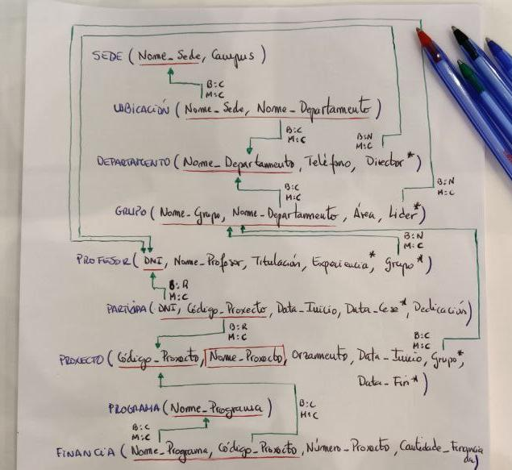

# Exercicio DDL 1 - Proxectos de Investigación

## **Enunciado**

Na Universidade de A Coruña deséxase levar un control sobre os proxectos de investigación que se desenvolven. Para iso decídese empregar unha base de datos que conteña toda a información sobre os proxectos, departamentos, grupos de investigación e profesores.

Un departamento identifícase polo seu nome (Informática, Enxeñería, etc). Ten unha sede situada nun determinado campus, un teléfono de contacto e un director, tamén profesor da Universidade de A Coruña.

Dentro dun departamento créanse grupos de investigación. Cada grupo ten un nome único dentro do departamento (pero que pode ser o mesmo en distintos departamentos) e está asociado a unha área de coñecemento (bases de datos, intelixencia artificial, sistemas e comunicacións, etc). Cada grupo ten un líder, tamén profesor da Universidade de A Coruña.

Un profesor está identificado polo seu DNI. Del deséxase saber o nome,  tilulación, anos de experiencia en investigación, grupo de investigación no que desenvolve o seu labor e proxectos nos que traballa.

Cada proxecto de investigación ten un nome, un código único, un orzamento, datas de inicio e terminación e un grupo que o desenvolve. Doutra banda, pode estar financiado por varios programas. Dentro de cada programa cada proxecto ten un número asociado e unha cantidade de diñeiro financiada (por exemplo, o proxecto `BDE - Bases de Datos Espaciais` ten o número `1337` dentro do programa `A Solaris e volta` que lle financia con 10.000 euros).

Un profesor pode participar en varios proxectos. En cada proxecto incorpórase nunha determinada data e cesa noutra, tendo unha determinada dedicación (en horas á semana) durante ese período.

A partir do esquema relacional proporcionado, implementalo en PostgreSQL.



***

## **Solución**

### --> Creación de tablas:

```SQL
CREATE TABLE Sede (
    Nome_Sede VARCHAR(255),
    Campus VARCHAR(255) NOT NULL,

    CONSTRAINT PK_Sede
	PRIMARY KEY (Nome_Sede)
);


CREATE TABLE Ubicacion (
    Nome_Sede VARCHAR(255),
    Nome_Departamento VARCHAR(255),

    CONSTRAINT PK_Ubicacion
	PRIMARY KEY (Nome_Sede, Nome_Departamento)
);


CREATE TABLE Departamento (
    Nome_Departamento VARCHAR(255),
    Telefono CHAR(9) NOT NULL,   -- Mejor CHAR que INTEGER
    Director CHAR(9),

    CONSTRAINT PK_Departamento
	PRIMARY KEY (Nome_Departamento)
);


CREATE TABLE Grupo (
    Nome_Grupo VARCHAR(255),
    Nome_Departamento VARCHAR(255),
    Area VARCHAR(255) NOT NULL,
    Lider VARCHAR(255),

    CONSTRAINT PK_Grupo
	PRIMARY KEY (Nome_Grupo, Nome_Departamento)
);


CREATE TABLE Profesor (
    DNI CHAR(9),
    Nome_Profesor VARCHAR(255) NOT NULL,
    Titulacion VARCHAR(255) NOT NULL,
    Experiencia VARCHAR(255),

    N_Grupo VARCHAR(255),      
    N_Departamento VARCHAR(255),

    -- Hay que hacer dos atributos que referencien los dos a la clave compuesta,
    -- no puede un solo atributo referenciar a una clave compuesta
    
    CONSTRAINT PK_Profesor
	PRIMARY KEY (DNI)
);


CREATE TABLE Participa (
    DNI CHAR(9),
    Codigo_Proxecto INTEGER,
    Data_Inicio DATE NOT NULL,
    Data_Cese DATE,
    Dedicacion VARCHAR(255) NOT NULL,

    CONSTRAINT PK_Participa
	PRIMARY KEY (DNI, Codigo_Proxecto)
);


CREATE TABLE Proxecto (
    Codigo_Proxecto INTEGER,
    Nome_Proxecto VARCHAR(255) NOT NULL,
    Orzamento MONEY NOT NULL,
    Data_Inicio DATE NOT NULL,
    N_Grupo VARCHAR(255),
    N_Departamento VARCHAR(255),
    Data_Fin DATE,

    CONSTRAINT PK_Proxecto
	PRIMARY KEY (Codigo_Proxecto),

    UNIQUE (Nome_Proxecto)
    -- Hay que utilizar UNIQUE para la clave candidata
);


CREATE TABLE Programa (
    Nome_Programa VARCHAR(255),

    CONSTRAINT PK_Programa
	PRIMARY KEY (Nome_Programa)
);


CREATE TABLE Financia (
    Nome_Programa VARCHAR(255),
    Codigo_Proxecto INTEGER,
    Numero_Proxecto INTEGER NOT NULL,
    Cantidade_Financiada MONEY NOT NULL,

    CONSTRAINT PK_Financia
	PRIMARY KEY (Nome_Programa, Codigo_Proxecto)
);
```


### --> Restricciones:


- **Claves Foráneas**:

    ```SQL
    ALTER TABLE Ubicacion
    ADD CONSTRAINT FK_UbicacionSede
    FOREIGN KEY (Nome_Sede) REFERENCES Sede(Nome_Sede)
    ON DELETE CASCADE
    ON UPDATE CASCADE;


    ALTER TABLE Ubicacion
    ADD CONSTRAINT FK_UbicacionDepart
    FOREIGN KEY (Nome_Departamento) REFERENCES Departamento(Nome_Departamento)
    ON DELETE CASCADE
    ON UPDATE CASCADE;


    ALTER TABLE Departamento
    ADD CONSTRAINT FK_Departamento
    FOREIGN KEY (Director) REFERENCES Profesor(DNI)
    ON DELETE SET NULL
    ON UPDATE CASCADE;


    ALTER TABLE Grupo
    ADD CONSTRAINT FK_GrupoDepart
    FOREIGN KEY (Nome_Departamento) REFERENCES Departamento(Nome_Departamento)
    ON DELETE CASCADE
    ON UPDATE CASCADE;


    ALTER TABLE Grupo
    ADD CONSTRAINT FK_GrupoLider
    FOREIGN KEY (Lider) REFERENCES Profesor(DNI)
    ON DELETE SET NULL
    ON UPDATE CASCADE;


    ALTER TABLE Profesor
    ADD CONSTRAINT FK_Profesor
    FOREIGN KEY (N_Grupo, N_Departamento) REFERENCES Grupo(Nome_Grupo, Nome_Departamento)
    ON DELETE SET NULL
    ON UPDATE CASCADE;


    ALTER TABLE Participa
    ADD CONSTRAINT FK_ParticipaDNI
    FOREIGN KEY (DNI) REFERENCES Profesor(DNI)
    ON DELETE  NO ACTION
    ON UPDATE CASCADE;


    ALTER TABLE Participa
    ADD CONSTRAINT FK_ParticipaCodProx
    FOREIGN KEY (Codigo_Proxecto) REFERENCES Proxecto(Codigo_Proxecto)
    ON DELETE NO ACTION
    ON UPDATE CASCADE;


    ALTER TABLE Proxecto
    ADD CONSTRAINT FK_Proxecto
    FOREIGN KEY (N_Grupo, N_Departamento) REFERENCES Grupo(Nome_Grupo, Nome_Departamento)
    ON DELETE SET NULL
    ON UPDATE CASCADE;


    ALTER TABLE Financia
    ADD CONSTRAINT FK_FinanciaProg
    FOREIGN KEY (Nome_Programa) REFERENCES Programa(Nome_Programa)
    ON DELETE CASCADE
    ON UPDATE CASCADE;


    ALTER TABLE Financia
    ADD CONSTRAINT FK_FinanciaCodProx
    FOREIGN KEY (Codigo_Proxecto) REFERENCES Proxecto(Codigo_Proxecto)
    ON DELETE CASCADE
    ON UPDATE CASCADE;
    ```

- **CHECKS**:

    ```SQL
    ALTER TABLE Participa
    ADD CONSTRAINT CHK_Participa
    CHECK (Data_Cese >= Data_Inicio);


    ALTER TABLE Proxecto
    ADD CONSTRAINT CHK_Proxecto
    CHECK (Data_Fin >= Data_Inicio);
    ```
