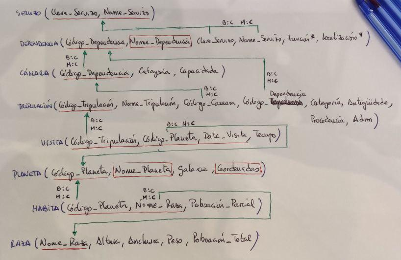

# Exercicio DDL 2 - Naves Espaciais

## **Enunciado**

O Ministerio da Exploración Interplanetaria da Federación Unida de Planetas desexa desenvolver un Sistema de Información para a nave espacial **Stanisław Lem 72** que proximamente se lanzará ao espazo.

A nave espacial componse de distintas dependencias, e cada unha delas ten un nome, un código (único para cada dependencia), unha función e unha localización. Cada dependencia está baixo o control dun determinado servizo, identificado por un nome e unha clave. Todo servizo da nave (Servizo de Operacións, Comando e Control, Seguridade, etc.) ha de estar asignado polo menos a unha dependencia.

Quérese levar ao día unha relación da tripulación da nave. Esta información contén o nome, código, categoría, antigüidade, procedencia e situación administrativa (en servizo, de baixa, etc). Cada tripulante está asignado a unha dependencia que desexa coñecer, así como a cámara na que se aloxa. Unha cámara é unha dependencia que posúe dúas características propias, a súa categoría e a súa capacidade.

Doutra banda, deséxanse coñecer os planetas que visitou cada membro da tripulación e o tempo que permaneceron neles para saber as persoas con quen se pode contar á hora de realizar unha exploración interplanetaria.

De cada planeta coñécese o seu nome e código, a galaxia e coordenadas nas que se atopa. Algúns planetas atópanse poboados por diversas razas, cada unha nunha certa cantidade de individuos. De cada raza almacénase información sobre o nome, poboación total e dimensións medias (altura, anchura, peso).

A partir do esquema relacional proporcionado, implementalo en PostgreSQL.



***

## **Solución**

### --> Creación de Dominios:

```SQL
CREATE DOMAIN Tipo_Código CHAR(5);
CREATE DOMAIN Nome_Válido VARCHAR(40);
```

### --> Creación de tablas:

```SQL
CREATE TABLE Servizo (
  Clave_Servizo Tipo_Codigo,
  Nome_Servizo  Nome_Válido,

  PRIMARY KEY (Clave_Servizo, Nome_Servizo)
);


CREATE TABLE Dependencia (
  Código_Dependencia Tipo_Código,
  Nome_Dependencia   Nome_Válido NOT NULL,
  Función            VARCHAR(20),
  Localización       VARCHAR(20),
  Clave_Servizo      Tipo_Codigo NOT NULL,
  Nome_Servizo       Nome_Válido NOT NULL,

  PRIMARY KEY (Código_Dependencia),
  UNIQUE (Nome_Dependencia),
  FOREIGN KEY (Clave_Servizo, Nome_Servizo)
    REFERENCES Servizo (Clave_Servizo, Nome_Servizo)
    ON DELETE Cascade
    ON UPDATE Cascade
);


CREATE TABLE Cámara (
  Código_Dependencia Tipo_Código,
  Categoría          Nome_Válido NOT NULL,
  Capacidade         INTEGER     NOT NULL,

  PRIMARY KEY (Código_Dependencia),
  FOREIGN KEY (Código_Dependencia)
    REFERENCES Dependencia
    ON DELETE Cascade
    ON UPDATE Cascade
);


CREATE TABLE Tripulación (
  Código_Tripulación Tipo_Código PRIMARY KEY,
  Nome_Tripulación   Nome_Válido,
  Categoría          CHAR(20)    NOT NULL,
  Antigüidade        INTEGER     DEFAULT 0,
  Procedencia        CHAR(20),
  Adm                CHAR(20)    NOT NULL,
  Código_Dependencia Tipo_Código NOT NULL,
  Código_Cámara      Tipo_Código NOT NULL,

  FOREIGN KEY (Código_Cámara)
    REFERENCES Cámara (Código_Dependencia)
    ON UPDATE Cascade
    ON DELETE Cascade
);


CREATE TABLE Planeta (
  Código_Planeta Tipo_Código          PRIMARY KEY,
  Nome_Planeta   Nome_Válido NOT NULL UNIQUE,
  Galaxia        CHAR(15)    NOT NULL,
  Coordenadas    CHAR(15)    NOT NULL,

  UNIQUE(Coordenadas)
);


CREATE TABLE Visita (
  Código_Tripulación Tipo_Código,
  Código_Planeta     Tipo_Código,
  Data_Visita        DATE,
  Tempo              INTEGER      NOT NULL,

  PRIMARY KEY (Código_Tripulación, Código_Planeta, Data_Visita),
  FOREIGN KEY (Código_Tripulación)
    REFERENCES Tripulación
    ON UPDATE CASCADE
    ON DELETE CASCADE,
  FOREIGN KEY (Código_Planeta)
    REFERENCES Planeta
    ON UPDATE CASCADE
    ON DELETE CASCADE 
);


CREATE TABLE Habita (
  Código_Planeta    Tipo_Código,
  Nome_Raza         Nome_Válido,
  Poboación_Parcial INTEGER     NOT NULL,

  PRIMARY KEY (Código_Planeta, Nome_Raza),
  FOREIGN KEY (Código_Planeta)
    REFERENCES Planeta
    ON UPDATE Cascade
    ON DELETE Cascade
);


CREATE TABLE Raza (
  Nome_Raza       Nome_Válido  PRIMARY KEY,
  Altura          INTEGER      NOT NULL,  -- cm
  Anchura         INTEGER      NOT NULL,  -- cm
  Peso            INTEGER      NOT NULL,  -- g
  Poboación_Total INTEGER      NOT NULL
);
```


### --> Restricciones:


- **Claves Foráneas**:

    ```SQL
    ALTER TABLE Tripulación
    ADD FOREIGN KEY (Código_Dependencia)
    REFERENCES Dependencia (Código_Dependencia)
    ON UPDATE Cascade
    ON DELETE Cascade;

    ALTER TABLE Habita
    ADD CONSTRAINT FK_Raza
    FOREIGN KEY (Nome_Raza)
      REFERENCES Raza
      ON UPDATE CASCADE
      ON DELETE CASCADE;
    ```

- **CHECKS**:

    ```SQL
    ALTER TABLE Cámara
    ADD CONSTRAINT Capacidade_maior_de_cero
    CHECK (capacidade > 0);
    ```
